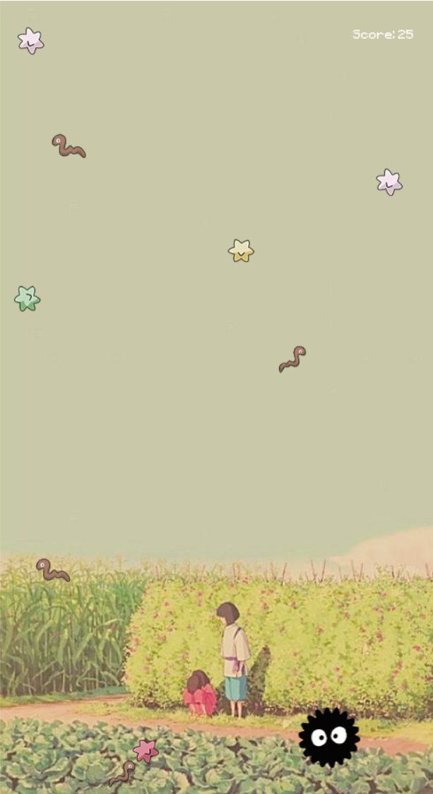
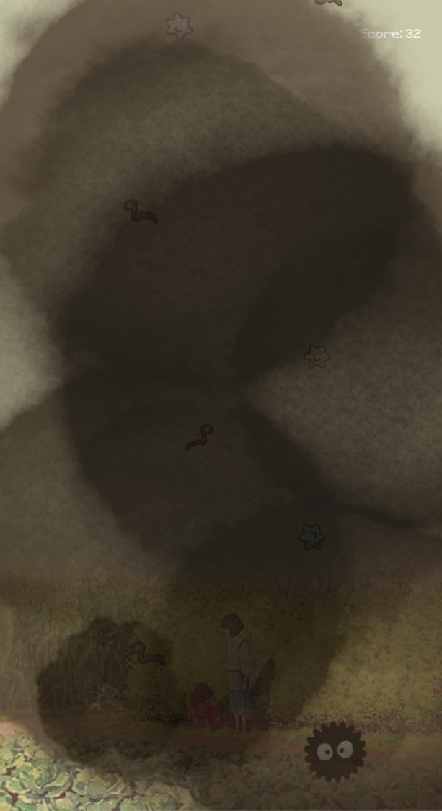

# Spirited Away Game

This side-scrolling game features a player-controlled soot spirit from the movie Spirited Away. The objective of the game is to collect as many candy stars as possible while avoiding worms in 60 seconds. I decided to create this game, since my first creation in Scratch (which was when I started my journey in Computer Science) was of a similar concept with very basic controls. 

All sprites in this games were drawn by me. The background of the game is a screenshot from the movie itself. 

This game is written in Lua using LÖVE framework.

## Video Demo
https://www.youtube.com/watch?v=lc0IM2NK_m4

## How to install and play
1. Download and install LÖVE: https://love2d.org/#download
2. Clone this repo
3. Drag the folder containing this repo onto the installed love.exe to run (or refer to https://love2d.org/wiki/Getting_Started for alternative ways)

## How to score
Different coloured candies give different points:
- white: 1 point
- green: 2 points
- red: 4 points
- yellow: 0 points and grants a special state where all candies on the screen will fly towards the soot spirit for a few seconds.

If the soot spirit eats a worm, the screen is covered with dirt for a few seconds to hinder vision, and the player loses 10 points. 

